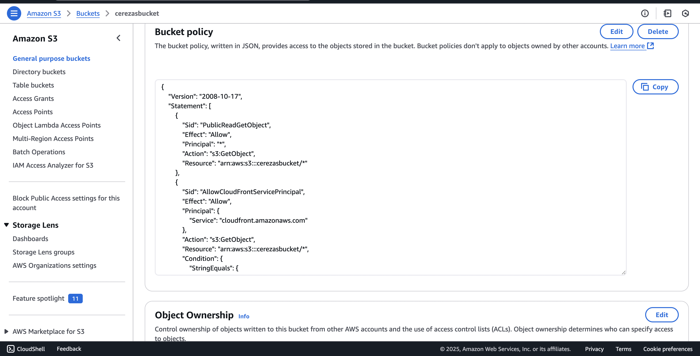
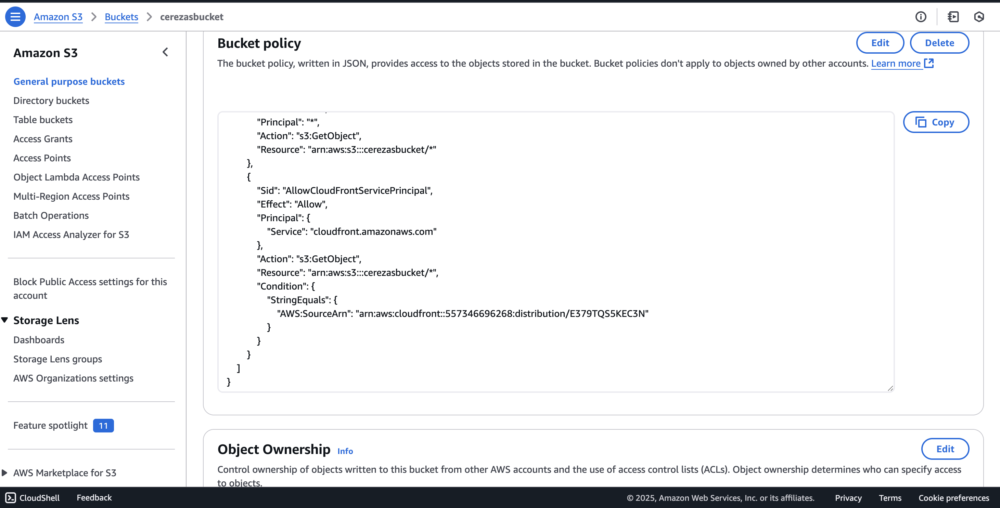
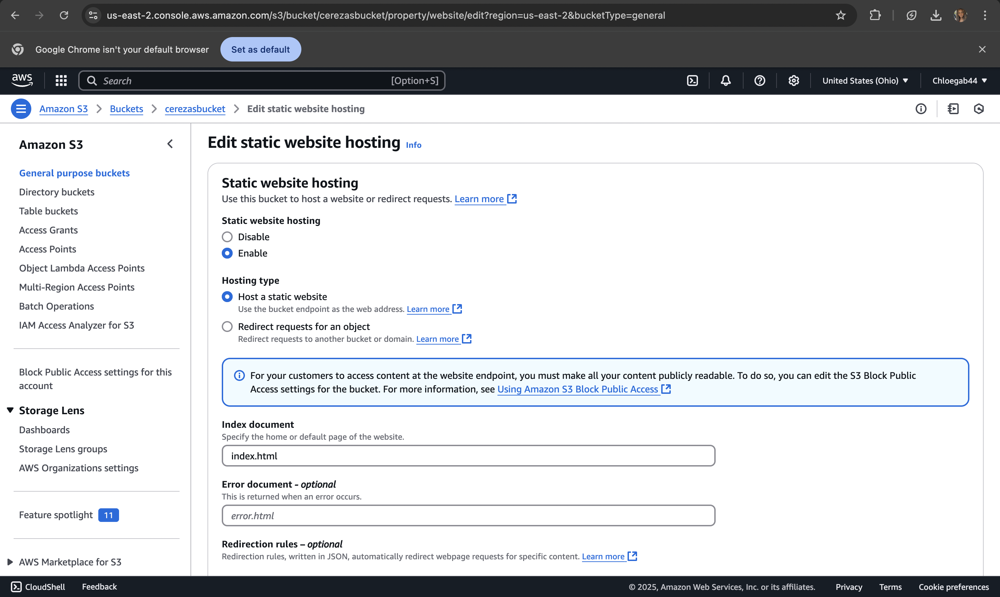
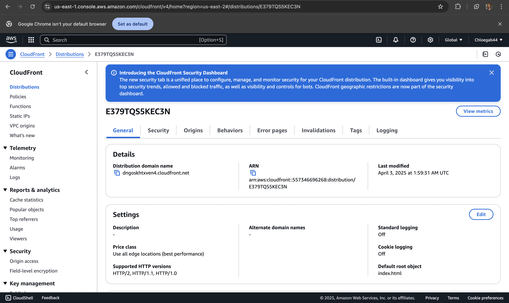
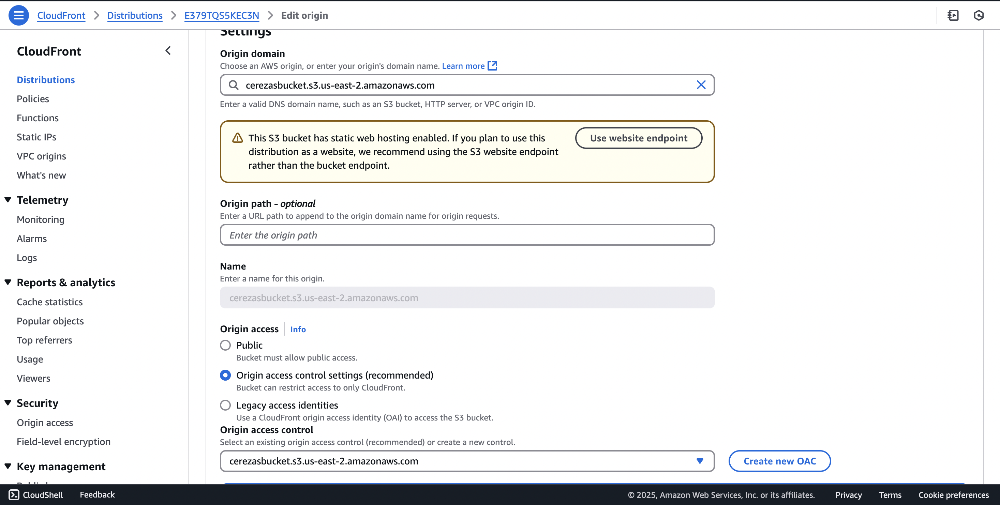
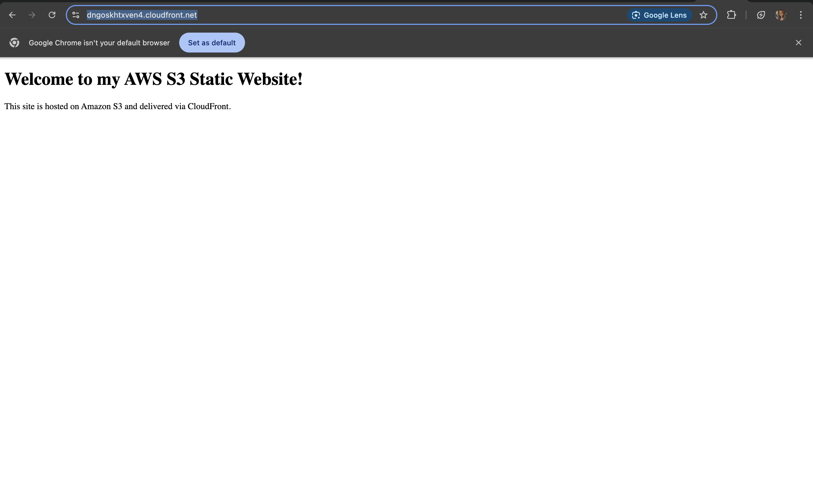

# AWS Static Website with S3 and CloudFront

This project demonstrates how to host a static website using **Amazon S3** and serve it globally using **CloudFront** as a content delivery network.

## Live Demo
[Visit the Website](https://dngoskhtxven4.cloudfront.net/)

---

## Features
- Static website hosting with HTML/CSS
- Amazon S3 for secure file storage
- Amazon CloudFront for fast, global content delivery
- Custom bucket policy for secure access
- HTTPS support

## Technologies Used
- AWS S3
- AWS CloudFront
- HTML/CSS
- AWS IAM (for access control)
- AWS Console

---

## Deployment Steps

1. **Create an S3 Bucket**
2. **Upload HTML files**
3. **Enable static website hosting**
4. **Create CloudFront Distribution**
5. **Set index.html as default root object**
6. **Apply bucket policy for CloudFront access**
7. **Test website with CloudFront URL**

---

## Screenshots

### S3 Bucket Files

### Static Website Hosting Settings

### CloudFront Distribution

### Live Website

---

## License
This project is open source and free to use.
